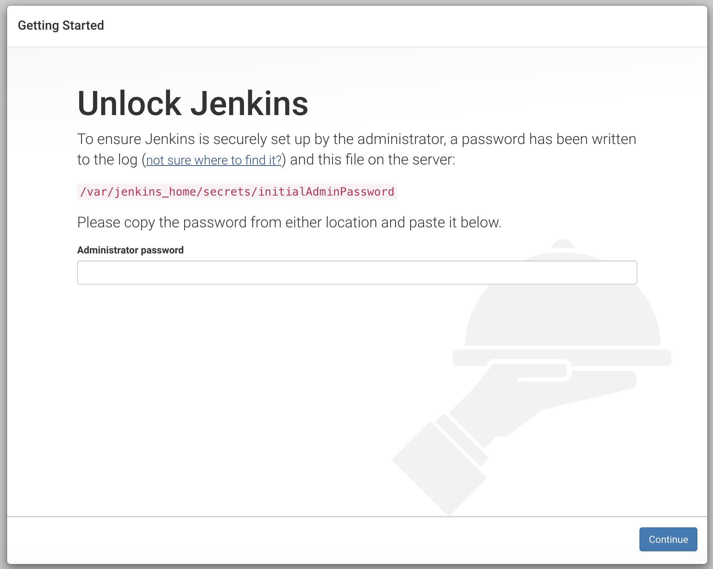
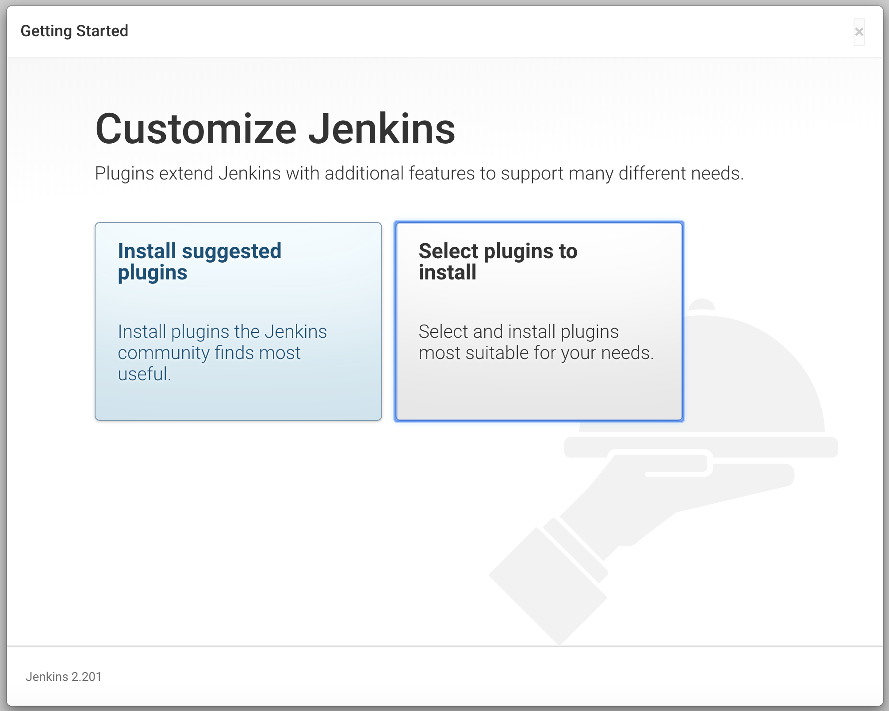
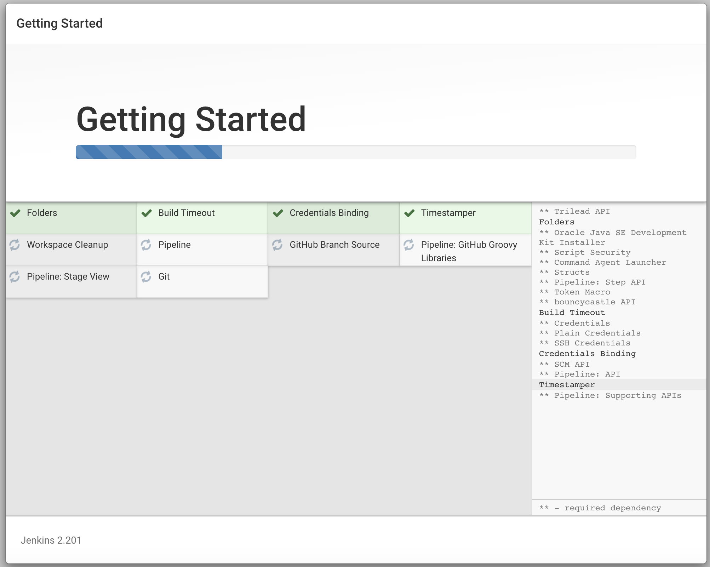
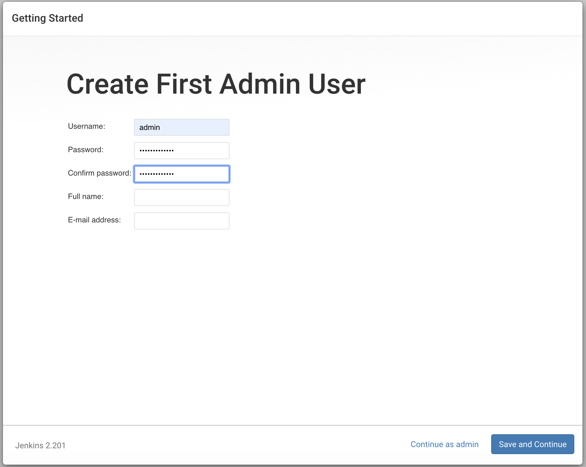
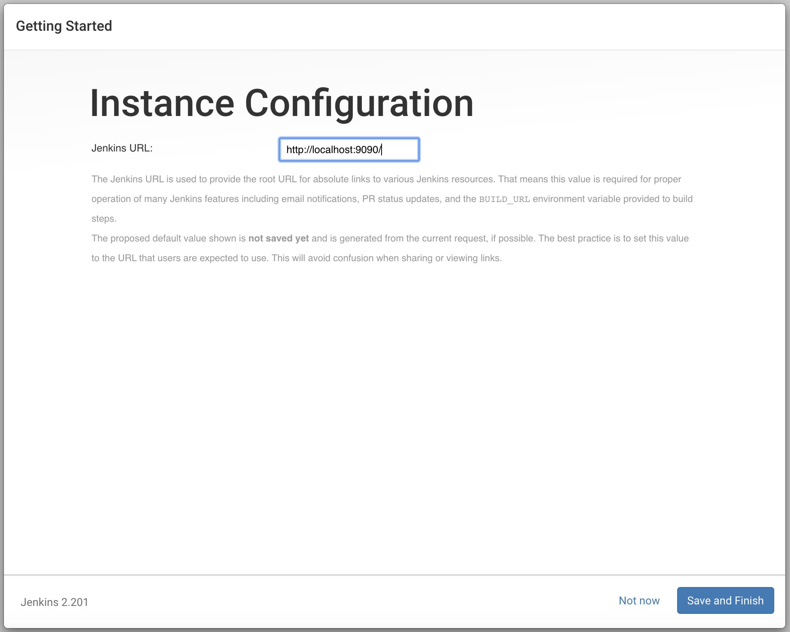
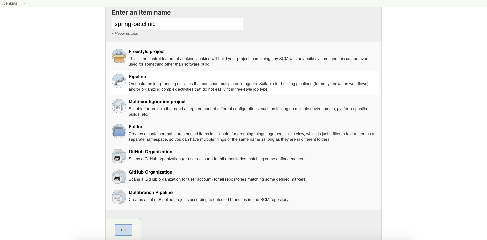
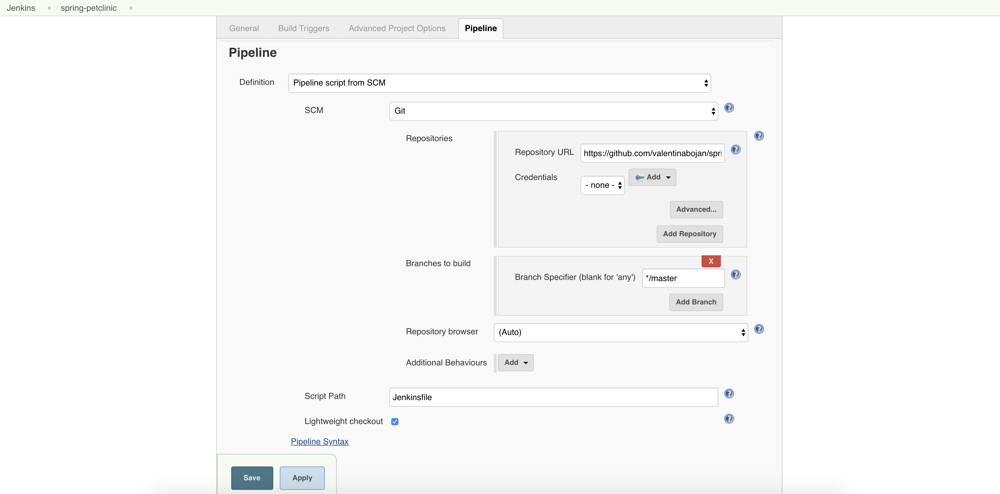

# jenkins-pipeline-workshop

## Pre-requisites

### Have a Jenkins server

We can easily have a containerized Jenkins using the following steps:

**1. Get the latest jenkins docker image** (see docs [here](https://hub.docker.com/r/jenkins/jenkins))
```
$ docker pull jenkins/jenkins
```

**2. Check your docker images**
```
$ docker images | grep "jenkins"
jenkins/jenkins        latest        eda4e3b68b8b        6 days ago        553MB
```

**3. Start the jenkins container** (see docs [here](https://github.com/jenkinsci/docker/blob/master/README.md))
```
$ docker run n -p 9090:8080 -v <absolute_path_to_jenkins_home_directory):/var/jenkins_home jenkins/jenkins
```

**4. Go to http://localhost:9090**

**5. Configure Jenkins**

**5a. Unlock Jenkins**

```
$ cat <absolute_path_to_jenkins_home_directory)/secrets/initialAdminPassword
```

Put the password here:


**5b. Select plugins to install**

Click `Select plugins to install`.



Select the following plugins to install:
* Folders
* Build Timeout
* Credentials Binding
* Timestamper
* Workspace Cleaner
* Pipeline
* GitHub Branch Source
* Pipeline: GitHub Groovy Libraries
* Pipeline: Stage View
* Git



**5c. Create first admin user**

Choose a _new password_ and set an _email address_ for your admin user. Click `Save and Continue`.



**5d. Skip the instance configuration (for now)**

Click `Save and Finish`.



**5e. Start using Jenkins**

You are good to go! 🍻


## Get a project to create a Jenkins pipeline for

For this, you can fork [Spring Pet Clinic](https://github.com/spring-projects/spring-petclinic) project.

## Create your first Jenkins pipeline job

From the Jenkins homepage, you click on the `create new job` link.


You will now see a screen to chose what type you want the new job to be.
For the sake of this tutorial, you will chose `Pipeline`.

Please don't forget to add a name for your new job 😉.



Next, you'll need to configure the new pipeline job to be able to checkout the spring-petclinic project you forked before.

Skip all configuration sections and focus on the fields from the `Pipeline` tab.

Here, change the `Definition` to `Pipeline script from SCM`.
This way, you will version in Git the Jenkinsfile containing the actual steps of your job.

Chose `Git` as your `SCM` and complete the repository url for the forked spring-petclinic project.

Let the other fields with their default values.

In the end, your configuration should look like the one below.



You can now `Save` your configuration.


